### 1 Training Progress

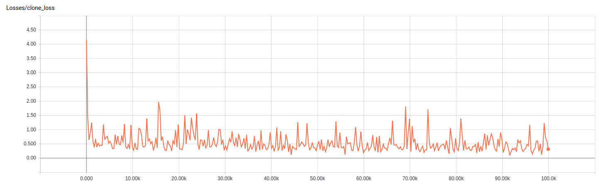

The model is trained on the downsized Mapillary dataset (every image is downsized into 384 by 512 pixels for faster training). 

The model is trained for 100,000 steps. It takes around 10 hours to finish the training on a GeForce 1080 Ti GPU.

The learning progress is shown above. We can see that the majority of the learning is done during the first 500 steps. 
After that, the model is trying to learn/correct fine details. The training loss fluctuates between 0.00 and 0.15.

### 2 Training results on validation set
Original Image             |  Training Result on 66 Classes | Ground Truth
:-------------------------:|:--------------:|:----------------:
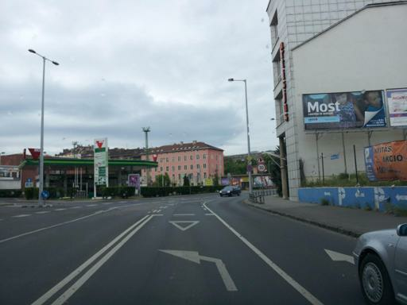  |   | 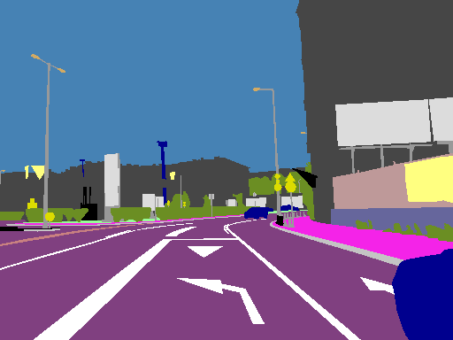 
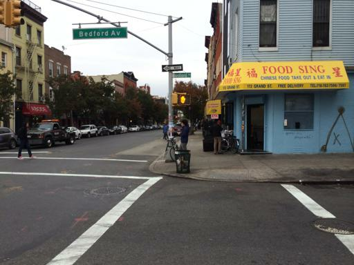  |   | 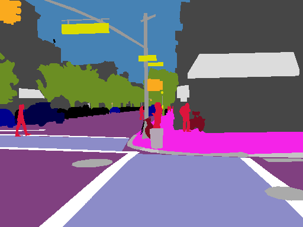 
  |  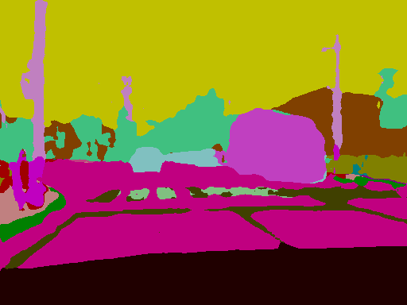 | 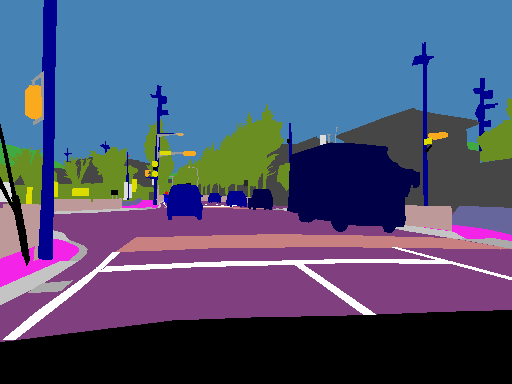 
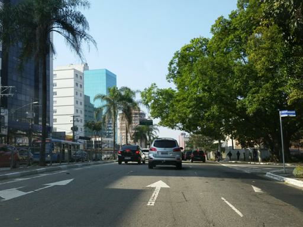  |   | 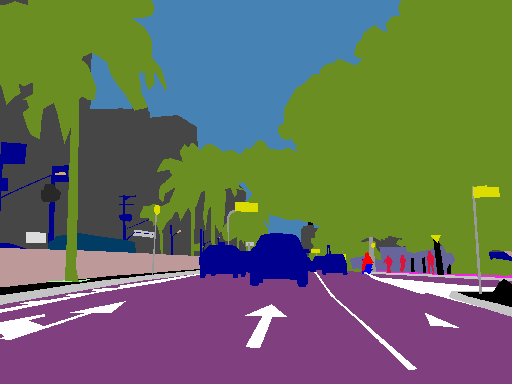 
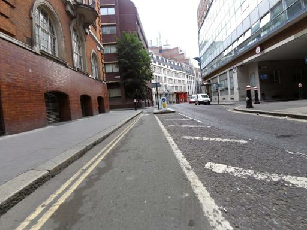  |  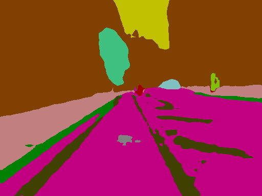 | 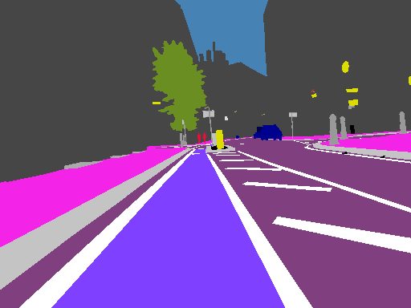 

The above images are sampled from the validation set. From the comparison between the training result and the ground truth, 
we can see that the model is limited to recognize fine details. However, the model can successfully classify most of the pixels 
and have improved significantly from [this](https://github.com/Transportation-Inspection/semantic_segmentation).

### 3 Inference on KITTI Sampled Images
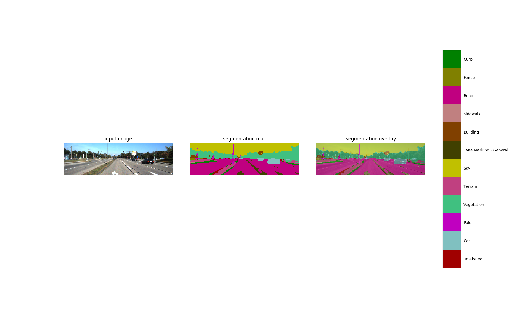
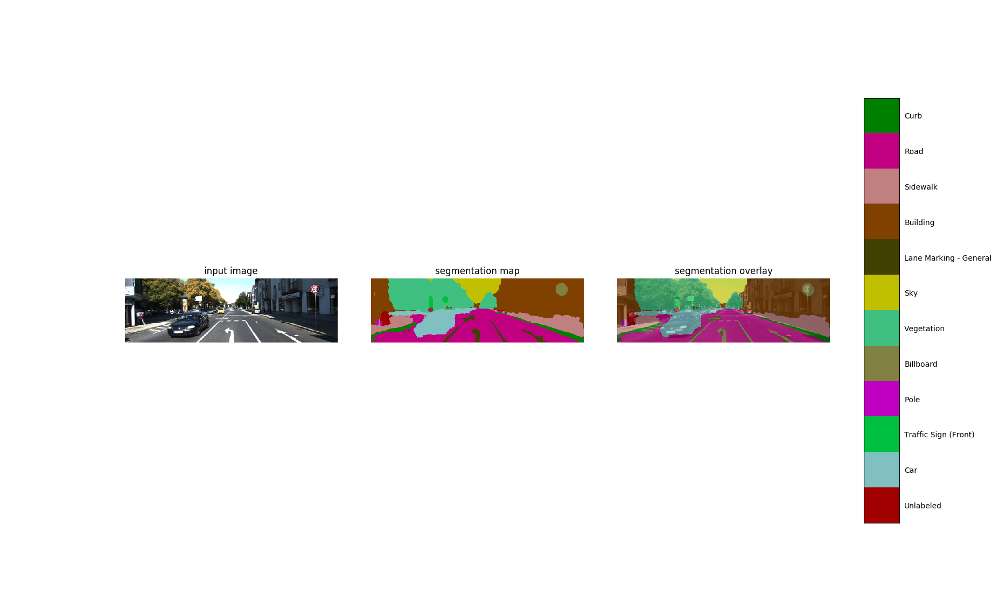
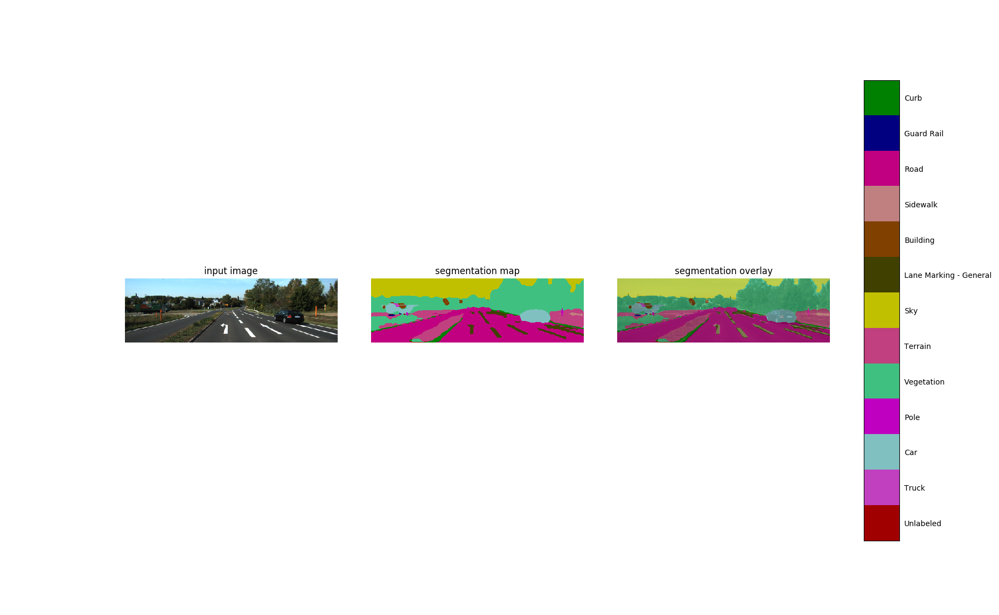

The above 3 images show how this model performs on any arbitrary images. The 3 images are sampled
from the KITTI dataset. We can see that our model can intelligently recognize the lane marking mostly. However, the correctness
is still limited.