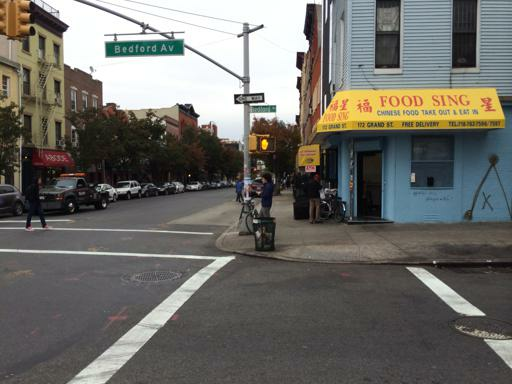
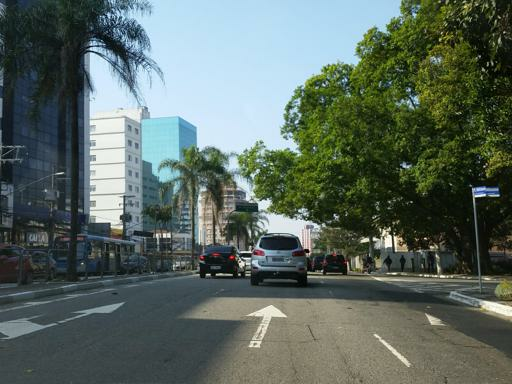
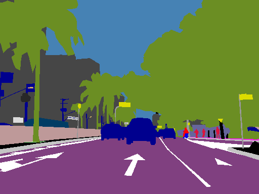
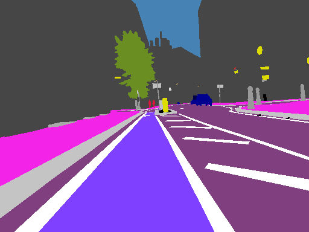

### 1 Training Progress

The model is trained on the downsized Mapillary dataset (every image is downsized into 384 by 512 pixels for faster training) 
with only 2 classes (either lane marking or not). 

The model is trained for 100,000 steps. It takes around 10 hours to finish the training on a GeForce 1080 Ti GPU.

The learning progress is shown above. We can see that the majority of the learning is done during the first 500 steps. 
After that, the model is trying to learn/correct fine details. The training loss fluctuates between 0.00 and 0.10. The 
fluctuation is less from the 66 classes. It is intuitive to understand, since there is less classes to classify and less 
chance to make mistakes.

### 2 Training results on validation set
Original Image             |  Training Result on 66 Classes | Ground Truth
:-------------------------:|:--------------:|:----------------:
  |   |  
  |   |  
  |   |  
  |   |  
  |   |  

The above images are sampled from the validation set. From the comparison between the training result and the ground truth, 
we can see that the model is able to learn a very clear contour for lane markings and has improved significantly from [this](https://github.com/Transportation-Inspection/semantic_segmentation).

Specifically, in the first and 4th row of images, we can see the arrows are very clearly recognized by our model. 

### 3 Inference on KITTI Sampled Images

The above 3 images show how this model performs on any arbitrary images. The 3 images are sampled
from the KITTI dataset. We can see that our model can intelligently recognize the lane marking. The overlane gives a 
great indication of how correctly our model finds the lane markings. The result is very impressive.