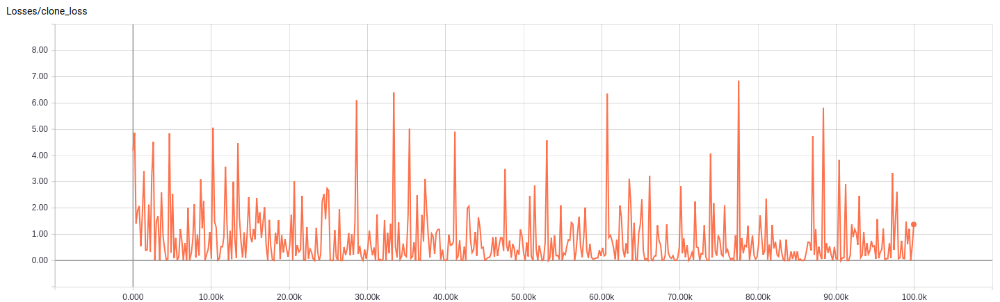
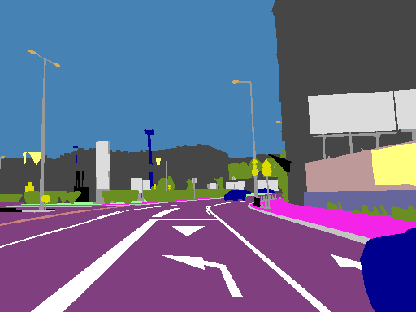
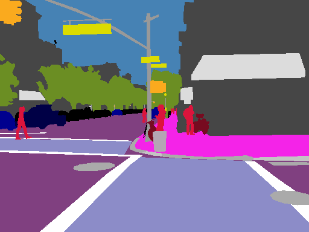
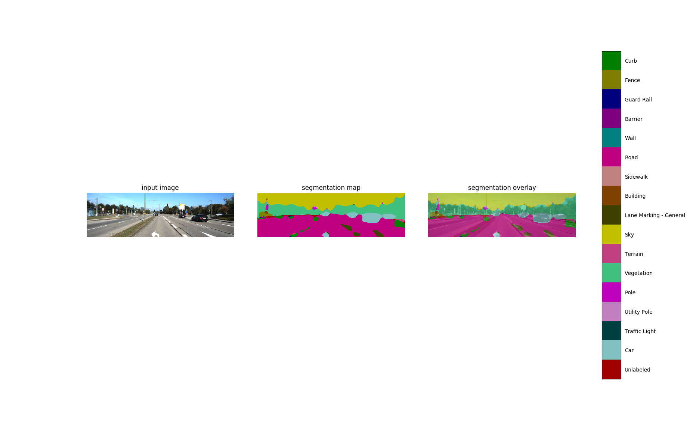
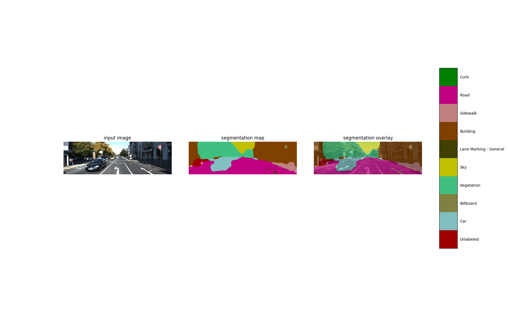
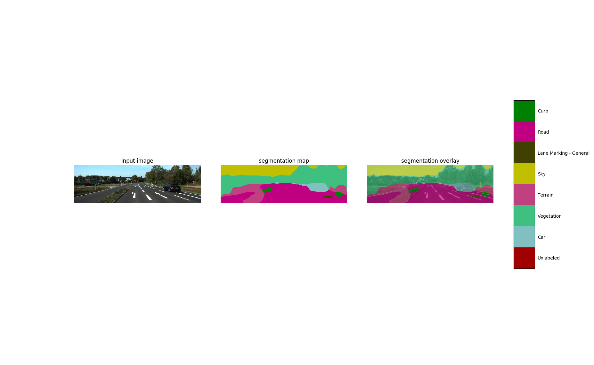

### 1 Training Progress

The model is trained on the original Mapillary dataset. Note that every image are of high-resolution. 

The model is trained for 100,000 steps. It takes around 10 hours to finish the training on a GeForce 1080 Ti GPU.

The learning progress is shown above. We can see that the training loss fluctuates with much higher variance compared to 
training on the downsized images. The training loss falls between 0.00 and 5.00. It is also intuitive, since there are 
many many more pixels, there are more chances for mistakes thus higher loss. 

### 2 Training results on validation set
Original Image             |  Training Result on 66 Classes | Ground Truth
:-------------------------:|:--------------:|:----------------:
  |   |  
  |   |  
  |   |  
  |   |  
  |   |  

The above images are sampled from the validation set. From the comparison between the training result and the ground truth, 
we can see that the model is limited to recognize fine details. The performance of this model is comparable with [this](https://github.com/Transportation-Inspection/semantic_segmentation).

### 3 Inference on KITTI Sampled Images

The above 3 images show how this model performs on any arbitrary images. The 3 images are sampled
from the KITTI dataset. We can see that our model cannot recognize lane markings at all. The model has very 
limited performance. 

To improve from this result, I think it makes sense to continue training this model for days (and even weeks) given 
how rich the original high-resolution dataset is.